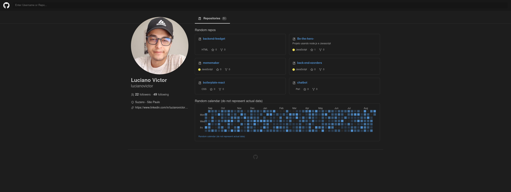

<h1 align="center">  Clone - Github </h1>

<p align="center">
  
</p>

## 💻 Projeto

Clone responsivo da interface do usuário do Github (parcial) para fins de estudo.

## 🧑‍💻 Techs    

-  [Vite.js](https://vitejs.dev/)
-  [Styled Components](https://styled-components.com/)
-  [TypeScript](https://www.typescriptlang.org/)
-  [React-Icons](https://react-icons.netlify.com/)
-  [Fetch-API](https://developer.mozilla.org/pt-BR/docs/Web/API/Fetch_API)


## 📥 Instalação e execução

Faça um clone desse repositório e acesse o diretório.

```zsh
# Instalando as dependências
$ yarn

# Executanto aplicação
$ yarn dev